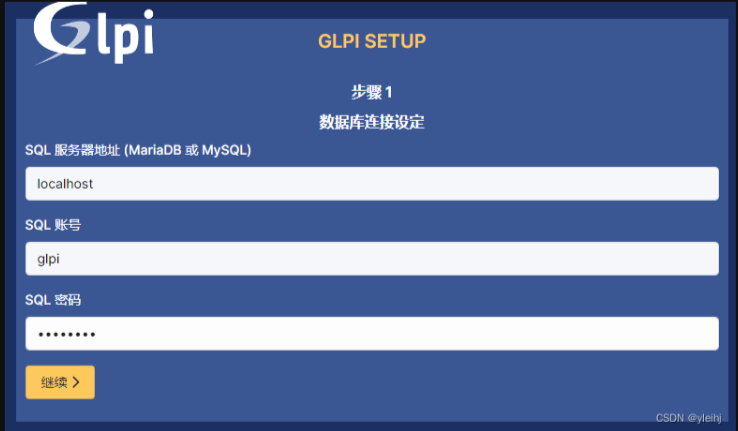

#环境准备

#####系统环境：rocky9
#####访问服务：Apahce  httpd  2.4
#####数据库：mariadb  10.5
#####PHP：8.0
  
](image.png)
###关闭防火墙
    systemctl stop firewalld
###关闭selinux
    sed -i 's/enforcing/disabled/' /etc/selinux/config
    setenforce 0
#安装步骤

## 1.安装Apahce  httpd  2.4
    yum install httpd* -y
    systemctl start httpd
    systemctl enable httpd

### 1.2配置Apahce  httpd  2.4

- 创建glpi.conf

> vim /etc/httpd/conf.d/glpi.conf

    <Directory "/usr/share/glpi/public>
        Order deny,allow
        Allow from all
        AllowOverride All
        Option Indexes FollowSymLinks
        DirectoryIndex index.php
    </Directory>

- 重启apache服务

        systemctl restart httpd

## 2.安装mariadb  10.5
    yum install mariadb-server -y
    systemctl start mariadb
    systemctl enable mariadb

- 创建glpi数据库，创建glpi用户，并授权

        CREATE DATABASE glpi CHARACTER SET utf8mb4 COLLATE utf8mb4_unicode_ci;
        GRANT ALL PRIVILEGES ON glpi.* TO 'ocs'@'localhost' IDENTIFIED BY 'New-Password';  <----要修改 New-Password 密碼
        FLUSH PRIVILEGES;
## 3.安装PHP
1. 安装EPEL存储库
   
        sudo dnf install https://dl.fedoraproject.org/pub/epel/epel-release-latest-8.noarch.rpm -y
2. 启用Remi库
   
        sudo dnf install dnf-utils http://rpms.remirepo.net/enterprise/remi-release-8.rpm -y
3. 列出库中所有php版本
   
        sudo dnf module list php -y
4. 重置php列表

        sudo dnf module list reset php -y
5. 启用PHP8.0
    
        sudo dnf module enable php:remi-8.0 -y
6. 安装PHP8.0
   
        sudo dnf install php -y
7. 安装PHP8.0扩展
    
        sudo dnf install php-cli php-fpm php-curl php-mysqlnd php-gd php-opcache php-zip php-intl php-common php-bcmath php-imap php-imagick php-xmlrpc php-json php-readline php-memcached php-redis php-mbstring php-apcu php-xml -y
8. 检查PHP版本
   
        php -v
#4.部署GLPI
1. 下载GLPI
    
        https://github.com/glpi-project/glpi/releases/download/10.0.10/glpi-10.0.10.tgz
2. 解压文件到/var/www/html/
   
        tar -xvf glpi-10.0.10.tgz -C /var/www/html/
3. 更改文件夹权限

        chown -R apache:apache /var/www/html/glpi
        chown -R apahce:apache /var/www/html/files
        chown -R apache:apache /var/www/html/config
4. 访问IP地址

        http://IP/glpi/
5. 安装GLPI
> 安装时需要输入数据库密码
> 
6. 安装成功