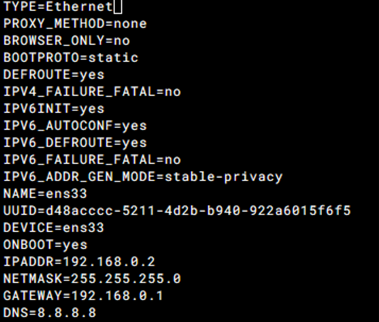

# 以下系统的网络配置及防火墙启停及文件位置
[TOC]


## 1. centos6.5
## 2. centos7.9
1. 网络服务启停
```
    systemctl enable NetworkManager     # 开机自启动
    systemctl disable NetworkManager    # 取消开机自启动
    systemctl status NetworkManager     # 查看状态
    systemctl restart NetworkManager    # 重启服务
    systemctl stop NetworkManager       # 停止服务
    systemctl start NetworkManager      # 启动服务
    systemctl status NetworkManager     # 查看状态
```
2. 网卡启停
```
    nmcli connection reload                  # 重新加载配置文件
    nmcli connection up id                   # 启动网卡
    nmcli connection down id                 # 关闭网卡
    nmcli connection show                    # 查看网卡信息
    nmcli device show                        # 查看网卡信息
    nmcli device status                      # 查看网卡状态
    nmcli device disconnect id               # 断开网卡连接
    nmcli device connect id                  # 连接网卡
```
3. 网卡文件位置及内容更改
> /etc/sysconfig/network-scripts/ifcfg-*
#### 如下图为静态IP配置例子

- BOOTPROTO=static 表示不使用dhcp，使用静态IP地址。
- NAME=ens33 表示网卡名称。
- DEVICE=ens33 表示网卡设备名称。
- ONBOOT=yes 表示系统启动时启用此设备。
- IPADDR=192.168.1.100 表示IP地址。
- NETMASK=255.255.255.0 表示子网掩码。
- GATEWAY=192.168.1.1 表示默认网关。
- DNS1=8.8.8.8 表示DNS服务器地址。
4. 启停防火墙
```
    systemctl enable firewalld                  # 开机自启动
    systemctl disable firewalld                 # 取消开机自启动
    systemctl status firewalld                  # 查看状态
    systemctl start firewalld                   # 启动服务
    systemctl stop firewalld                    # 停止服务
    systemctl restart firewalld                 # 重启服务
```
## 3.rocky8.9


## 4.rocky9.3