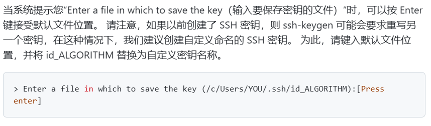
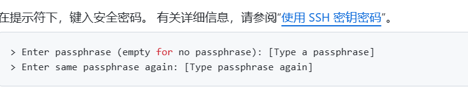
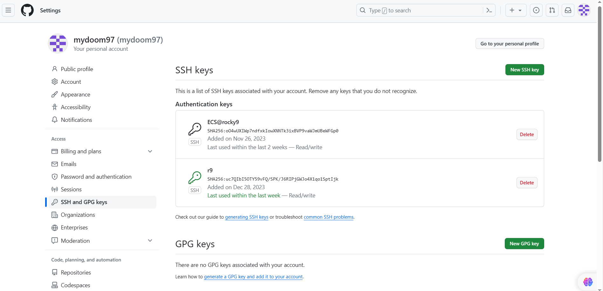
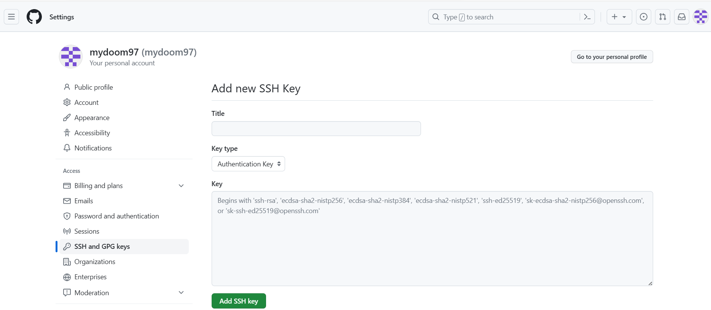

## 一.打开终端，以下命令生成密钥，引号内容替换为GitHub注册使用邮箱

```shell
ssh-keygen -t ed25519 -C "your_email@example.com"
```

### 1.1更改密钥生成位置

### 1.2创建安全密码在拉取、推送时验证

## 二.添加密钥

### 2.1找到生成密钥时所创建的文件*.pub，例如以下

### 2.2打开GitHub网页并找到设置进行添加

