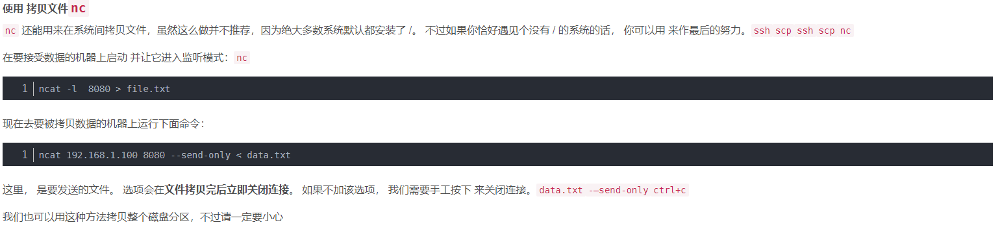
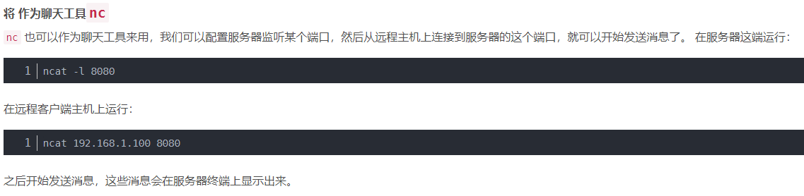
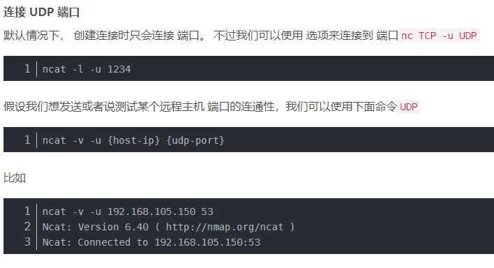

# 常用网络工具

1. nc（ncat）

## 1. nc（ncat）

### 1.1 简介：ncat 网络实用程序取代了红帽企业 Linux 7 中的 netcat。ncat 是可靠的后端工具，可向其他应用和用户提供网络连接。它从命令行在网络上读取和写入数据，并使用传输控制协议(TCP)、用户数据报协议(UDP)、流控制传输协议(SCTP)或 Unix 套接字进行通信。ncat 可以处理 IPv4 和 IPv6、打开连接、发送数据包、执行端口扫描，并支持更高级别的功能，如 SSL 和连接代理

### 1.2 命令格式

> ncat [options] [hostname] [port]

### 1.3 常用参数

1. -4仅使用IPv4
2. -6仅使用IPv6
3. -u，--unixsock仅使用Unix域套接字
4. -C，--crlf对EOL序列使用CRLF
5. -c，--sh-exec<Command>通过 /bin/sh执行给定的命令
6. -e，--exec<Command>执行给定的命令
7. --lua-exec<filename>执行给定的Lua脚本
8. -g Hop1[， Hop2，…]松散源路由跳点（最多8个）
9. -g<n>松源路由跳指针（4,8,12，…）
10. -m，--max-conns<n>最大同时连接数
11. -h，--help显示此帮助屏幕
12. -d，--延迟<time>读/写之间的等待
13. -o，--out<filename>将会话数据转储到文件
14. -x，--hex-dump<filename>将会话数据作为十六进制转储到文件
15. -i，--idle-timeout<time>空闲读/写超时
16. -p，--source-port port指定要使用的源端口
17. -s，--source addr指定要使用的源地址（不影响-l）
18. -l，--听绑定并监听传入连接
19. -k，--保持打开在监听模式下接受多个连接
20. -n，--nons不通过DNS解析主机名
21. -t，--telnet回答Telnet谈判
22. -u，--udp使用UDP而不是默认TCp
23. --sctp使用SCTP而不是默认TCP
24. -v，--verose设置详细级别（可以使用多次）
25. -w，--wait<time>连接超时
26. -z零I/O模式，仅报告连接状态
27. --append-out追加而不是关闭指定的输出文件
28. --send-Only只发送数据，忽略已收到；在EOF上退出
29. --recv-Only只接收数据，从不发送任何东西
30. --允许仅允许给定主机连接到Ncat
31. --lowfile允许连接到Ncat的主机文件
32. --拒绝给定主机连接到Ncat
33. --denyfile拒绝连接到Ncat的主机文件
34. --broker  启用Ncat的连接代理模式
35. --chat启动一个简单的Ncat聊天服务器
36. --proxy<addr[： port]>指定要代理的主机地址
37. --proxy-type<type>指定代理类型（“http”或“socket ks4”或“socket ks5”）    
38. --proxy-auth<auth>使用HTTP或SOCKS代理服务器进行身份验证
39. --ssl使用SSL连接或收听
40. --ssl-cert指定用于侦听的SSL证书文件（PEM）
41. --ssl-key指定用于侦听的SSL私钥（PEM）
42. --ssl-验证证书的信任和域名
43. --ssl-trufile包含受信任SSL证书的PEM文件
44. --ssl-ciphers包含要使用的SSL密码的密码列表
45. --version显示Ncat的版本信息并退出

### 1.4 示例

> 指定端口监听入站连接。
```
ncat -l port_number
```
> 连接远程系统
```
ncat IP_address port_number
```
> 发送文件



> 即时通讯



> UDP连接


7
